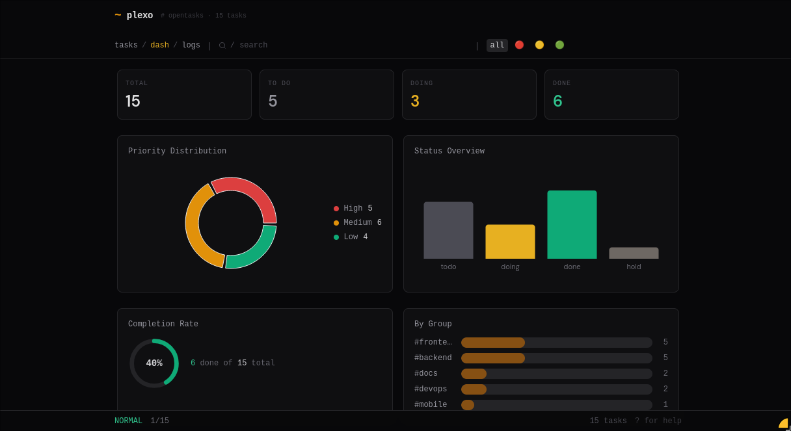

  <strong>🇧🇷 Português</strong> &nbsp;|&nbsp; <a href="README.en.md">🇺🇸 English</a>

  

<h1 align="center">📋 Plexo</h1>

  Gerenciador de tarefas centralizado com <strong>Web UI</strong>, <strong>Terminal UI</strong> e <strong>API REST</strong>.
   
  Totalmente local, JSON puro, sem banco de dados.

  <a href="README.pt-BR.md">🇧🇷 Ler em Português</a>
  &nbsp;·&nbsp;
  <a href="README.en.md">🇺🇸 Read in English</a>

