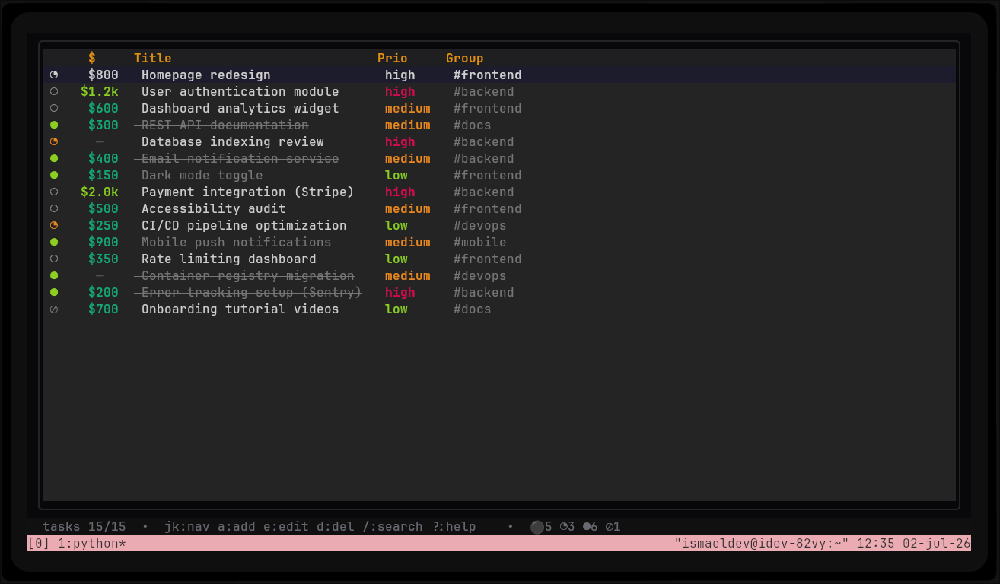
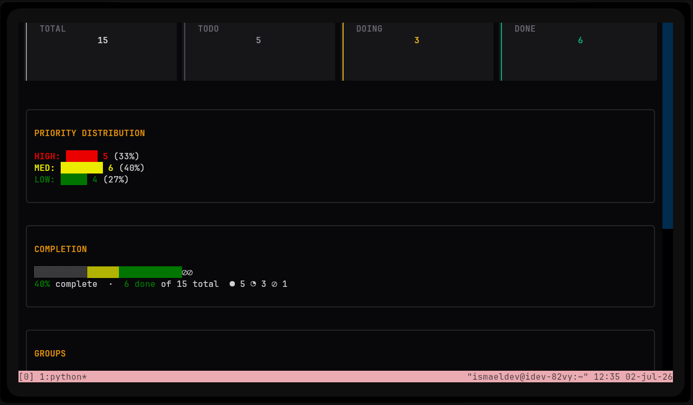
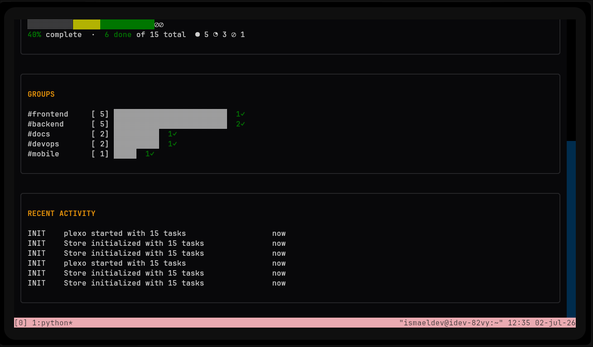
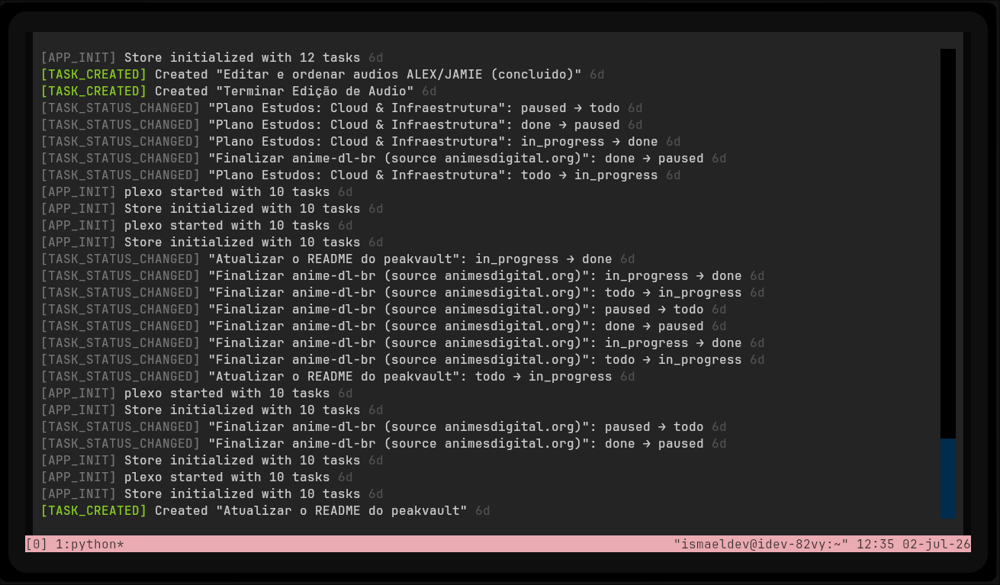
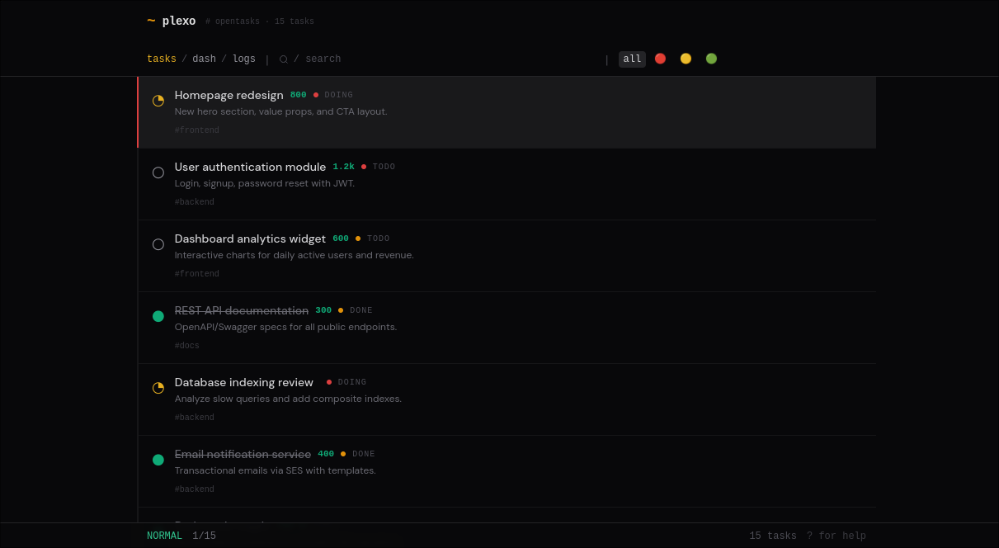
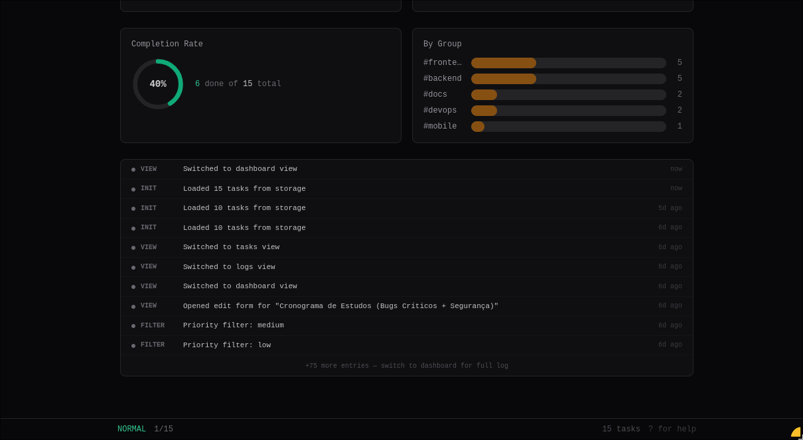
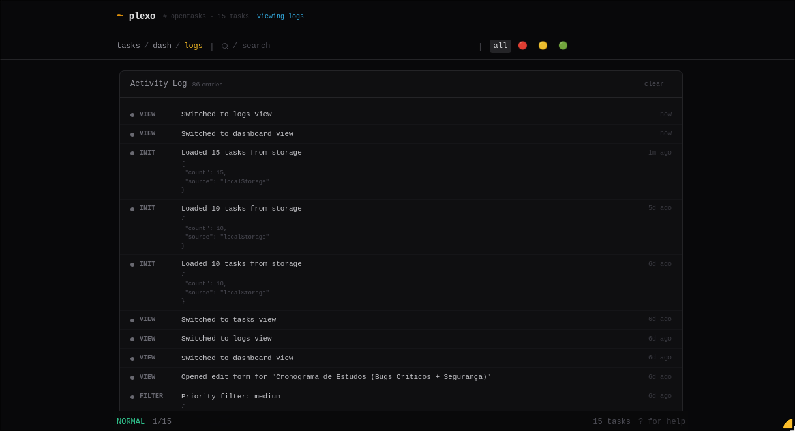

<p align="center">
  <strong>🇧🇷 Português</strong> &nbsp;|&nbsp; <a href="README.en.md">🇺🇸 English</a>
</p>

# Plexo — Gerenciador Centralizado de Tarefas

Plexo é um gerenciador de tarefas leve e auto-hospedado com **três interfaces**: uma **Web UI** moderna (React + Vite), uma **Terminal UI** (Textual) e uma **API REST**.

> Suas tarefas ficam em `~/.plexo/tasks.json` — JSON puro, totalmente local, sem banco de dados.

---

## Capturas de Tela

### Terminal UI

| Tarefas (1) | Dashboard (2) |
|-------------|---------------|
|  |  |
| **Dashboard (2) — baixo** | **Logs (3)** |
|  |  |

### Web UI

| Tarefas | Dashboard |
|---------|-----------|
|  |  |
| **Dashboard — baixo** | **Logs** |
|  |  |

---

## Funcionalidades

- **Web UI** — Dashboard com cards de tarefas, filtros, badges de prioridade, estatísticas
- **Terminal UI** — TUI completa com atalhos de teclado (`a` adicionar, `e` editar, `d` deletar, `/` buscar)
- **API REST** — Endpoints CRUD para tarefas + log de atividades
- **Tempo real** — Web UI consulta a API a cada 10s para atualizações ao vivo
- **Sistema de prioridade** — Alta / Média / Baixa com badges visuais
- **Grupos** — Organize tarefas por projeto ou contexto
- **Log de atividades** — Cada criação, atualização e conclusão é registrada
- **Logging no servidor** — Todas as operações registradas em `~/.plexo/logs.json`

---

## Início Rápido

```bash
# 1. Inicie o servidor da API
./serve.sh 8082

# 2. Abra a Web UI
xdg-open http://localhost:8082

# 3. Ou inicie a Terminal UI
./plexo
```

---

## Architecture

```
task-manager/
├── server.py          # Python API server (http.server)
├── serve.sh           # Server launcher
├── plexo              # TUI launcher script
├── src/               # React + Vite frontend
│   ├── components/    # UI components (shadcn/ui + Radix)
│   ├── hooks/         # Custom React hooks
│   ├── data/          # Data layer
│   └── lib/           # Utilities
├── tui/               # Terminal UI (Python Textual)
│   └── app.py         # TUI application
├── dist/              # Built frontend (served by server.py)
└── public/            # Static assets
```

### Data Flow

```
User ──► Web UI  ──┐
         TUI    ──┤──► API (server.py:8082) ──► ~/.plexo/tasks.json
         curl   ──┘                            ~/.plexo/logs.json
```

---

## Integração com Agentes (Skills de IA)

O Plexo pode ser controlado por agentes de IA (OpenCode, Claude Code, etc.) via sua API REST, tornando-se um **hub de tarefas para fluxos de trabalho com agentes**.

Agentes usam a [**skill do plexo**](https://github.com/ismaeldouglasdev/plexo) para:
- **Onboarding** — Carregar tarefas pendentes no início da sessão
- **Descoberta** — Criar tarefas automaticamente quando o usuário menciona novo trabalho
- **Rastreamento** — Atualizar status da tarefa (todo → in_progress → done)
- **Observabilidade** — Notificar o usuário ao concluir via notificação desktop

### Fluxo do agente

```
Agente inicia → Carrega skill plexo → GET /api/tasks → Mostra tarefas pendentes
    ↓
Usuário menciona tarefa → POST /api/tasks/add → Cria automaticamente com contexto
    ↓
Trabalho concluído → POST /api/tasks/update-status → Notificação desktop
```

Isso transforma o Plexo em um **backbone persistente de tarefas** para desenvolvimento assistido por IA — não importa qual agente ou sessão, todos veem as mesmas tarefas.

---

## Endpoints da API

| Método | Endpoint | Descrição |
|--------|----------|-----------|
| `GET` | `/api/tasks` | Listar todas as tarefas |
| `POST` | `/api/tasks/add` | Criar uma tarefa |
| `POST` | `/api/tasks/update-status` | Alterar status da tarefa |
| `POST` | `/api/tasks/delete` | Deletar uma tarefa |
| `GET` | `/api/logs` | Histórico de atividade |
| `GET` | `/api/stats` | Contagens de tarefas (total, todo, done, etc.) |

Todos os dados são armazenados em JSON puro em `~/.plexo/` — sem dependências externas.

---

## Desenvolvimento

```bash
# Instalar dependências
pnpm install

# Iniciar servidor de desenvolvimento Vite
pnpm dev

# Compilar frontend
pnpm build

# Recompilar e reiniciar servidor
pnpm build && ./serve.sh 8082
```

O frontend é construído com **React 19**, **TypeScript**, **Vite**, **Tailwind CSS** e **shadcn/ui**. A TUI usa **Python Textual**.

---

## Atalhos de Teclado (TUI)

| Tecla | Ação |
|-------|------|
| `a` | Adicionar tarefa |
| `e` | Editar tarefa |
| `d` | Deletar tarefa |
| `Enter` | Alternar status (todo ↔ done) |
| `/` | Buscar |
| `1` | Visão de tarefas |
| `2` | Dashboard |
| `3` | Logs |
| `q` | Sair |

---

## License

MIT
